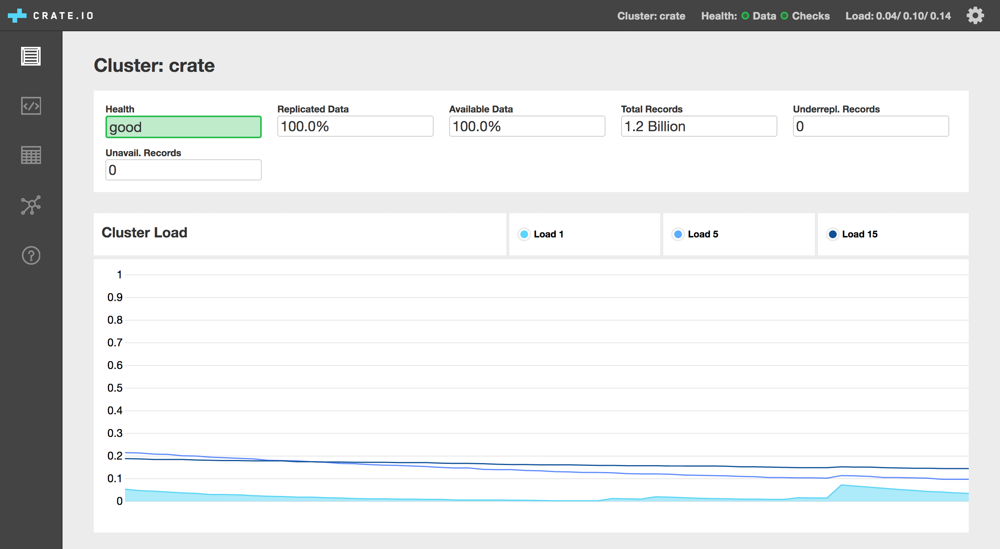

================
CrateDB Admin UI
================

An admin user interface (UI) for `CrateDB`_.

The admin interface is bundled with every CrateDB distribution. There is no need
to install it separately unless you are contributing to the project.

Screenshots
===========

Contributing
============

This project is primarily maintained by `Crate.io`_, but we welcome community
contributions!

See the `developer docs`_ and the `contribution docs`_ for more information.

Help
====

Looking for more help?

- Read `the project documentation`_
- Check `StackOverflow`_ for common problems
- Chat with us on `Slack`_
- Get `paid support`_

.. _Bower: http://bower.io
.. _contribution docs: CONTRIBUTING.rst
.. _Crate.io: http://crate.io/
.. _CrateDB: https://github.com/crate/crate
.. _developer docs: DEVELOP.rst
.. _paid support: https://crate.io/pricing/
.. _Slack: https://crate.io/docs/support/slackin/
.. _StackOverflow: https://stackoverflow.com/tags/crate
.. _the project documentation: https://crate.io/docs/connect/admin_ui/
