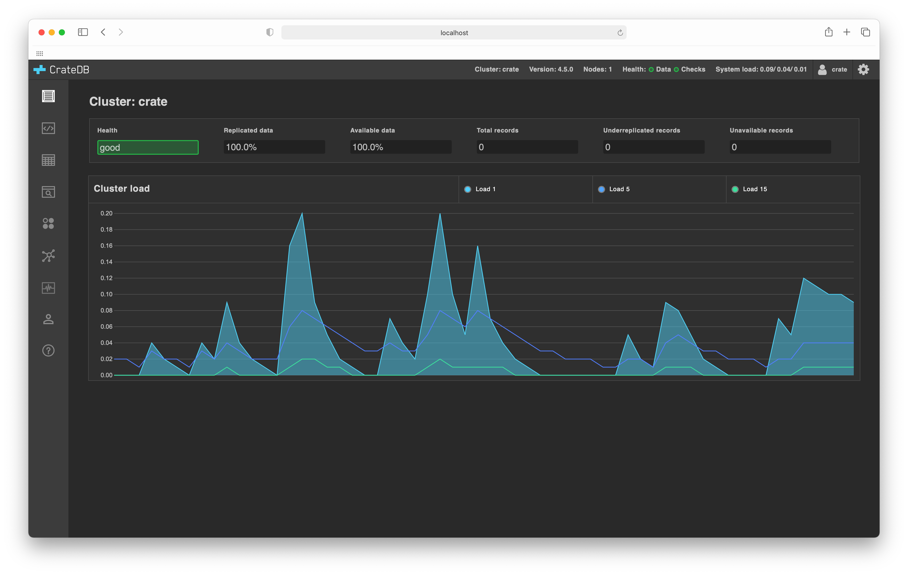

================
CrateDB Admin UI
================

|test-status| |test-coverage| |rtd|

An admin user interface (UI) for `CrateDB`_.

The admin interface is bundled with every CrateDB distribution. Unless you are
contributing to the project, there is no need to install it separately.

Contributing
============

This project is primarily maintained by `Crate.io`_, but we welcome community
contributions!

See the `developer docs`_ and the `contribution docs`_ for more information.

Help
====

Looking for more help?

- Read the `project docs`_
- Check out our `support channels`_

.. _Bower: http://bower.io
.. _contribution docs: CONTRIBUTING.rst
.. _Crate.io: http://cratedb.com/
.. _CrateDB: https://github.com/crate/crate
.. _developer docs: DEVELOP.rst
.. _project docs: https://cratedb.com/docs/connect/admin_ui/
.. _support channels: https://cratedb.com/support/

.. |test-status| image:: https://github.com/crate/crate-admin/workflows/Tests/badge.svg
    :alt: Test status
    :target: https://github.com/crate/crate-admin/actions?workflow=Tests

.. |test-coverage| image:: https://codecov.io/gh/crate/crate-admin/branch/main/graph/badge.svg
    :alt: Test coverage
    :target: https://codecov.io/gh/crate/crate-admin

.. |rtd| image:: https://readthedocs.org/projects/crate-admin-ui/badge/?version=latest
    :alt: Read The Docs status
    :target: https://readthedocs.org/projects/crate-admin-ui
