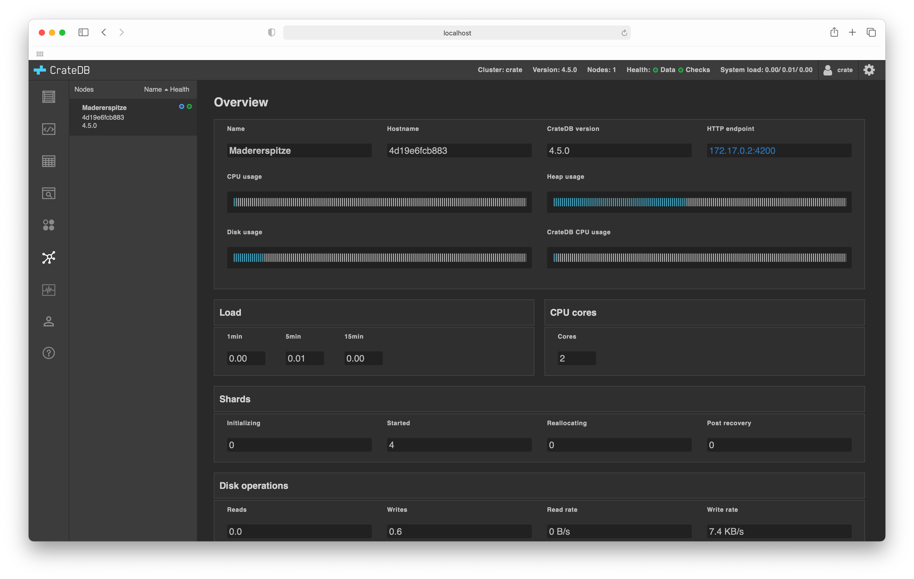

.. _cluster-browser:

===============
Cluster browser
===============

The :ref:`CrateDB Admin UI <index>` comes with a *cluster browser* that allows
you to inspect all of the nodes that are in your `cluster`_.

.. rubric:: Table of contents

.. contents::
   :local:

.. _cluster-screenshots:

Screenshots
===========

Here's what a single node cluster looks like:

In this example, there is one node named *Monte Civetta*. When selected from
the left-hand sub-navigation menu, information about a node is displayed.

.. _cluster-features:

Features
========

The cluster browser features:

**Node listing**:
  The list of nodes gives basic summary information for each node: node name,
  hostname, CrateDB version, and a visual icon indicating whether the node is a
  ``master node`` or not and the node :ref:`data status <index-status-bar>`
  health check.

**Node list ordering**:
  The list of nodes can be ordered by name or node health.

**Detailed node information**:
  Selecting a node from the node list will display details about that particular
  node.

The following subsections explain the detailed node information.

.. _cluster-node-info:

Node information
================

.. _cluster-overview:

Overview
--------

.. _cluster-node-name:

**Name**:
  The name of the node.

  CrateDB automatically names unnamed nodes.

.. _cluster-node-hostname:

**Hostname**:
  The hostname of the node.

.. _cluster-node-version:

**CrateDB Version**:
  The version of CrateDB the node is running.

  This is important information when performing a `rolling upgrade`_.

.. _cluster-node-http:

**HTTP endpoint**:
  The URL of the node's `HTTP endpoint`_.

.. _cluster-node-cpu:

**CPU Usage**:
  A visual indicator of system CPU utilization.

.. _cluster-node-heap:

**Heap Usage**:
  A visual indicator of allocated *Java Virtual Machine* (JVM) `heap`_
  utilization.

.. _cluster-node-disk:

**Disk Usage**:
  A visual indicator of system disk space utilization.

.. _cluster-node-crate-cpu:

**CrateDB CPU Usage**:
  A visual indicator of the CrateDB process CPU utilization.

.. _cluster-load:

Load
----

.. _cluster-load-1min:

**1min**:
  Average `load`_ over one minute.

.. _cluster-load-5min:

**5min**:
  Average load over five minutes.

.. _cluster-load-15min:

**15min**:
  Average load over fifteen minutes.

.. _cluster-cpu:

CPU cores
---------

.. _cluster-cpu-cores:

**Cores**:
  The number of CPU cores.

.. _cluster-shards:

Shards
------

.. _cluster-shards-initializing:

**Initializing**:
  The number of :ref:`shards <shards-browser>` currently being initialized.

.. _cluster-shards-started:

**Started**:
  The number of started shards.

.. _cluster-shards-reallocating:

**Reallocating**:
  The number of shards that are being moved to another node.

.. _cluster-shards-post-recovery:

**Post Recovery**:
  The number of shards that have been recovered but have not yet been started.

.. _cluster-disk:

Disk operations
---------------

.. _cluster-disk-read:

**Read**:
  Total size of reads on the disk in bytes.

  This value is `deprecated`_.

.. _cluster-disk-write:

**Write**:
  Total size of writes on the disk in bytes.

  This value is `deprecated`_.

.. _cluster-disk-reads:

**Reads**:
  Number of reads on the disk.

.. _cluster-disk-writes:

**Writes**:
  Number of writes on the disk.

.. _cluster: https://crate.io/docs/crate/guide/en/latest/architecture/shared-nothing.html
.. _deprecated: https://crate.io/docs/crate/reference/en/latest/admin/system-information.html#fs
.. _heap: https://en.wikipedia.org/wiki/Java_virtual_machine#Generational_heap
.. _HTTP endpoint: https://crate.io/docs/crate/reference/en/latest/interfaces/http.html
.. _load: https://en.wikipedia.org/wiki/Load_(computing)
.. _master node: https://crate.io/docs/crate/reference/en/latest/config/node.html#node-types
.. _rolling upgrade: https://crate.io/docs/crate/guide/en/latest/admin/rolling-upgrade.html
