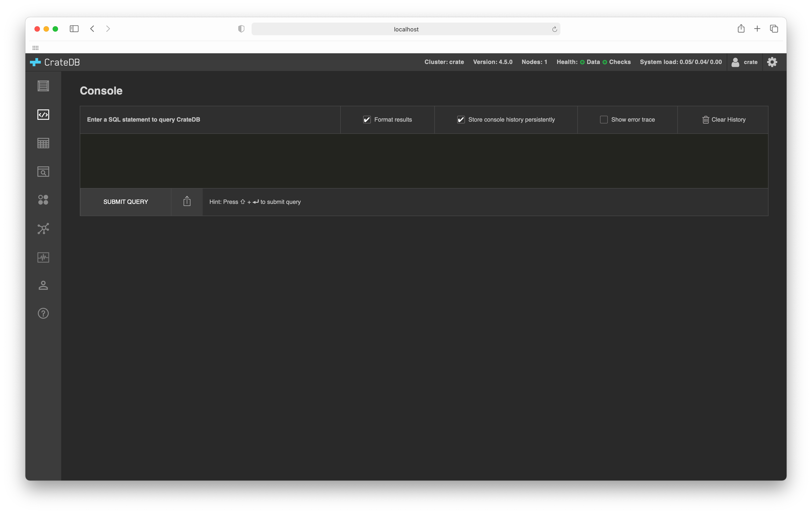
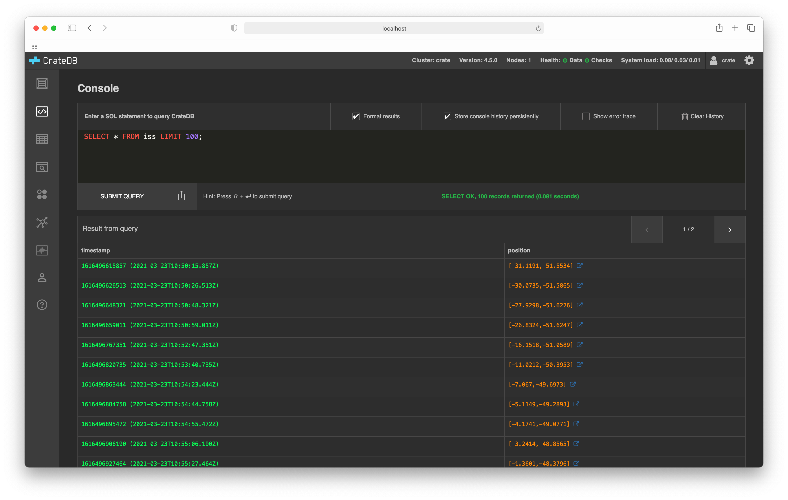

.. _sql-console:

===========
SQL console
===========

The :ref:`CrateDB Admin UI <index>` comes with an *SQL console* so that you can
execute queries against your cluster directly from your web browser.

When you first load the console, it will look like this:

You can enter any SQL statement with autocompletion and syntax highlighting
and see the result below:

.. _console-features:

Features
========

.. _console-results-formatting:

**Results formatting**:
  Toggle the *Format results* checkbox to switch between raw JSON and tabulated
  data.

.. _console-query-history:

**Query history**:
  Toggle the *Store console history persistently* to disable and enable query
  history. Previous queries can be cycled through by pressing the :kbd:`Up
  Arrow` key. You can clear your query history by selecting the *Clear history*
  button.

.. _console-query-urls:

**Query URLs**:
  Select the *share* icon located in the bottom right-hand corner of the query
  panel. This will copy a URL to your clipboard that can be saved or shared that
  will auto-load the corresponding query when visited. Queries are not
  automatically executed when you visit a URL.

.. _console-error-traces:

**Error traces**:
  Toggle the *Show error trace* checkbox to view a detailed Java stack trace in
  the event of an execution error.
