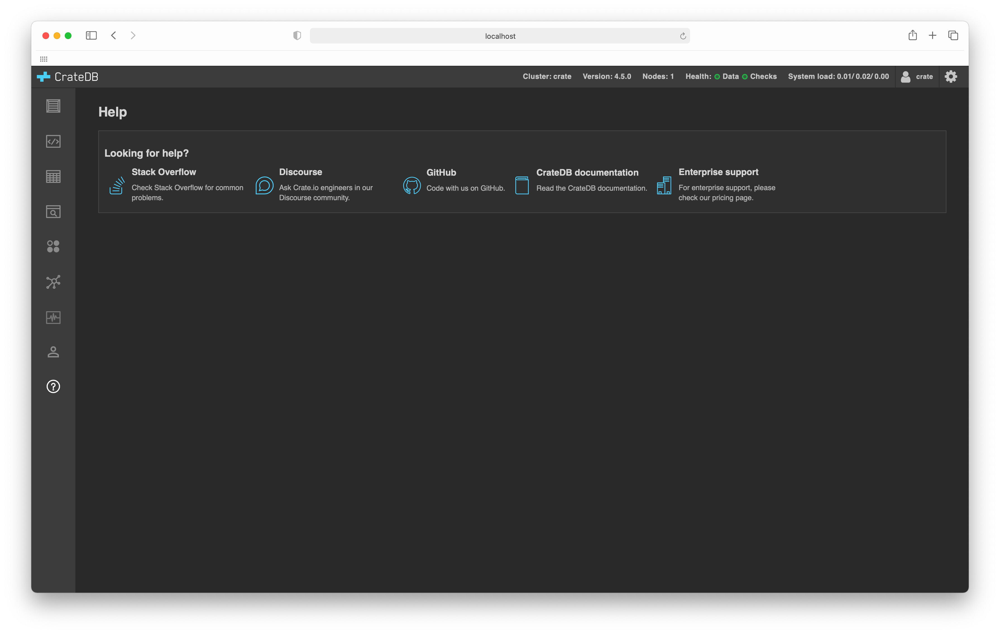

.. _help-screen:

===========
Help screen
===========

The :ref:`CrateDB Admin UI <index>` comes with a *help screen* that allows you
to import some tweets for testing purposes. This screen also includes links to
important CrateDB support resources.

.. rubric:: Table of contents

.. contents::
   :local:

Screenshot
==========

.. _help-features:

Features
========

This page includes links to various help resources.
