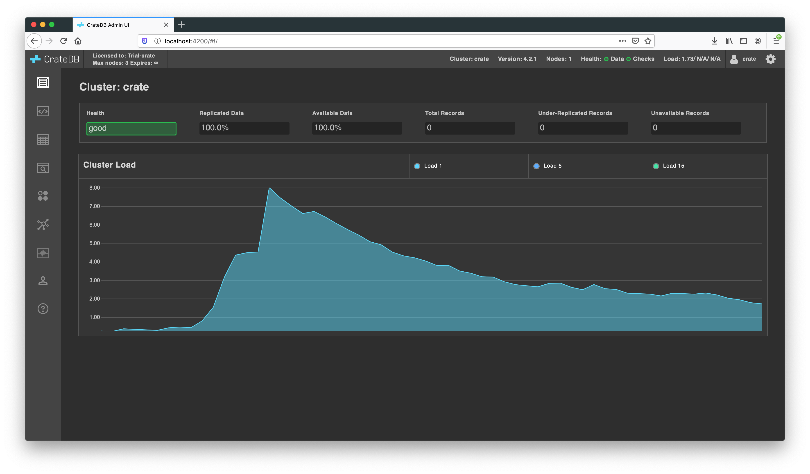

.. _index:

====================
The CrateDB Admin UI
====================

CrateDB ships with a web administration user interface (or *Admin UI*).

The CrateDB Admin UI runs on every CrateDB node. You can use it to inspect
and interact with the whole CrateDB cluster in a number of ways.

.. SEEALSO::

   The CrateDB Admin UI is an open source project and is `hosted on GitHub`_.

.. rubric:: Table of contents

.. contents::
   :local:

Connecting
==========

You can access the Admin UI via HTTP on port ``4200``::

  http://HOSTNAME:4200/

Replace ``HOSTNAME`` with the hostname of the CrateDB node. If CrateDB is
running locally, this will be ``localhost``.

Navigate to this URL in a web browser.

.. TIP::

    If you access port ``4200`` via a client library or command-line tool 
    like ``curl`` or ``wget``, the request will be handled by the `CrateDB
    Rest API`_, and the response will be in JSON.

Navigating
==========

This is what the Admin UI looks like when it first loads:

.. NOTE::

   This is the standard theme. The `Community Edition`_ of CrateDB uses a
   lighter theme.

Take note of the  `status bar`_ (at the top) and the `tabs`_ (down the left side).

.. _status-bar:

Status bar
----------

Along the top of the screen, from left to right, the status bar shows:

- `Cluster name`_

- CrateDB version

- Number of nodes in the cluster

- Health checks

  - Data status:

    :Green: All data is replicated and available
    :Yellow: Some records are unreplicated
    :Red: Some data is unavailable

  - Cluster status:

    :Green: Good configuration
    :Yellow: Some configuration warnings
    :Red: Some configuration errors

- Average cluster load (for the past 1 minute, 5 minutes, and 15 minutes)

- Settings and notifications menu

Tabs
----

.. toctree::
   :hidden:

   console
   tables
   shards
   cluster
   monitoring
   privileges
   help

On the left-hand side, from top to bottom, the tabs are:

- Overview screen

- :ref:`SQL console <sql-console>`

- :ref:`Tables browser <tables-browser>`

- :ref:`Shards browser <shards-browser>` *

- :ref:`Cluster browser <cluster-browser>`

- :ref:`Monitoring overview <monitoring-overview>` *

- :ref:`Privileges browser <privileges-browser>` *

- :ref:`Help screen <help-screen>`

  `*` *only available in the* `enterprise version`_ 

.. _Cluster name: https://crate.io/docs/crate/reference/en/latest/config/node.html#basics
.. _Community Edition: https://crate.io/docs/crate/reference/en/latest/editions.html#cratedb-community-edition
.. _CrateDB Rest API: https://crate.io/docs/crate/reference/en/latest/interfaces/http.html
.. _enterprise version: https://crate.io/docs/crate/reference/en/latest/editions.html#cratedb
.. _hosted on GitHub: https://github.com/crate/crate-admin
