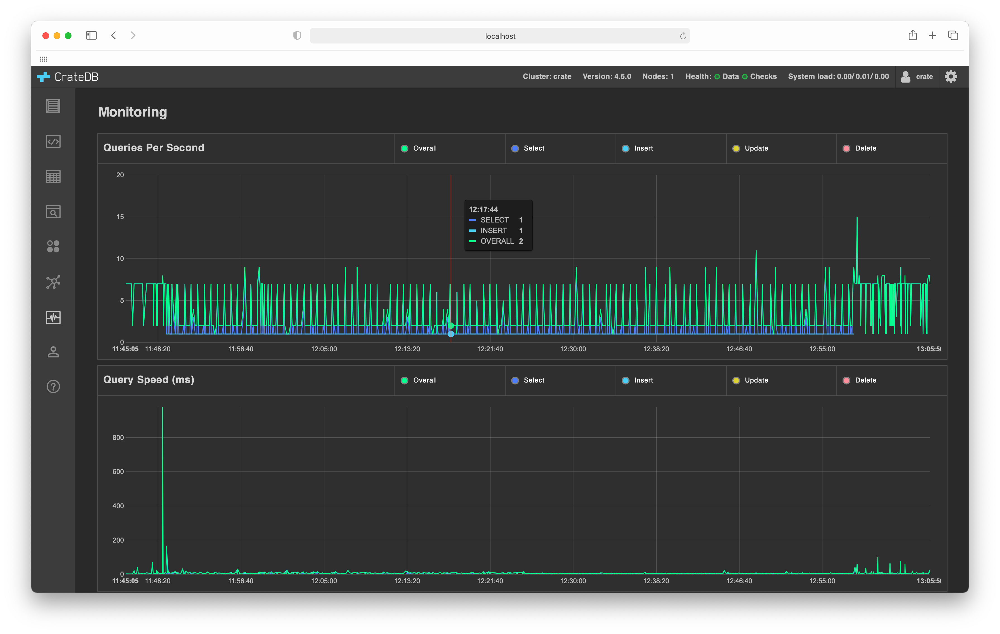

.. _monitoring-overview:

===================
Monitoring overview
===================

The :ref:`CrateDB Admin UI <index>` comes with a *monitoring overview* screen
that allows you to monitor key operational statistics.

.. NOTE::

   The monitoring overview is an `enterprise feature`_.

.. rubric:: Table of contents

.. contents::
   :local:

.. _monitoring-screenshots:

Screenshots
===========

The monitoring page has two live charts:

.. _monitoring-queries-per-second:

**Queries Per Second**:
  This chart graphs the number of queries being run across the entire cluster
  per second broken down into the following types:

  **Overall**:
    All queries.

  **Select**:
    All `SELECT`_ queries.

  **Insert**:
    All `INSERT`_ queries.

  **Update**:
    All `UPDATE`_ queries.

  **Delete**:
    All `DELETE`_ queries.

.. _monitoring-query-speed:

**Query Speed**:
  This chart graphs the execution time of queries being run across the entire
  cluster, broken down into the following types:

  **Overall**:
    All queries.

  **Select**:
    All `SELECT`_ queries.

  **Insert**:
    All `INSERT`_ queries.

  **Update**:
    All `UPDATE`_ queries.

  **Delete**:
    All `DELETE`_ queries.

.. _DELETE: https://crate.io/docs/crate/reference/en/latest/sql/statements/delete.html
.. _enterprise feature: https://crate.io/docs/crate/reference/en/latest/enterprise/index.html
.. _INSERT: https://crate.io/docs/crate/reference/en/latest/sql/statements/insert.html
.. _SELECT: https://crate.io/docs/crate/reference/en/latest/sql/statements/select.html
.. _UPDATE: https://crate.io/docs/crate/reference/en/latest/sql/statements/update.html
