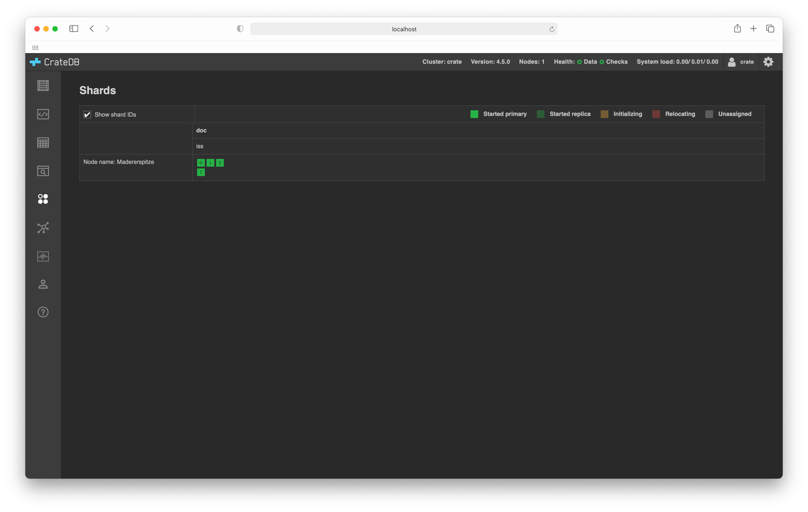

.. _shards-browser:

==============
Shards browser
==============

The :ref:`CrateDB Admin UI <index>` comes with a *shards browser* that
provides you with a visual overview of all the `shards`_ in your cluster.

.. rubric:: Table of contents

.. contents::
   :local:

.. _shards-screenshots:

Screenshots
===========

Here's what a simple database might look like:

In this example, there is one primary column:

 - The *blob* column holds `BLOB tables`_

 - The *doc* column holds regular `document tables`_

The *blob* column lists a single table:

 - ``my_blobs``

The *doc* column lists a single table:

 - ``tweets``

Below this, the table has one row per node in the cluster. CrateDB
automatically names unnamed nodes. In this instance, there is a single node
named *Monte Civetta*.

In this example, the *Monte Civetta* node is holding the following shards:

 - Three shards for the table named ``my_blobs``

 - Four shards for the table named ``tweets``

Shards are colored to indicate their status and there is a color key at the
top of the table.

The color of the shards in this example indicates that they are all primary
shards and have been successfully started.

.. _shards-features:

Features
========

.. _shards-id-display:

**Shard ID display**:
  You can toggle the display of shard IDs by selecting or unselecting the *Show
  Shard IDs* checkbox.

.. _shards-status:

**Shard status**:
  Each shard is colored according to its status:

  **Started Primary (bright green)**:
     This is a primary shard that has been successfully started, allocated to
     a node, and is available for querying.

  **Started Replica (dark green)**:
     This is a `replica`_ shard that has been successfully started, allocated to
     a node, and is available for querying.

  **Initializing (dark yellow)**:
     The shard is being initialized (i.e. being started).

  **Relocating (dark red)**:
     The shard is being relocated to another node.

     CrateDB automatically rebalances your cluster for you. While a shard is
     being moved to another node, it is unavailable for use.

  **Unassigned (gray)**:
     The shard exists on disk, but has not yet been allocated to a node.

.. _BLOB tables: https://crate.io/docs/crate/reference/en/latest/general/blobs.html
.. _document tables: https://crate.io/docs/crate/reference/en/latest/general/ddl/create-table.html
.. _replica: https://crate.io/docs/crate/reference/en/latest/general/ddl/replication.html
.. _shards: https://crate.io/docs/crate/reference/en/latest/general/ddl/sharding.html
