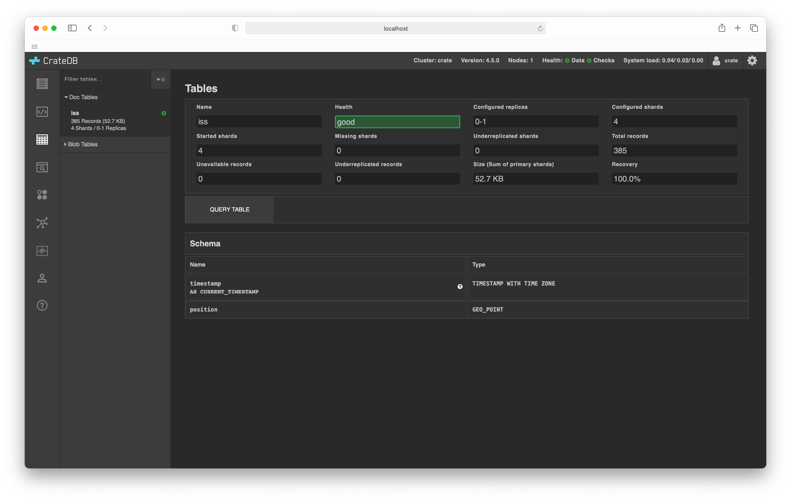

.. _tables-browser:

==============
Tables browser
==============

The :ref:`CrateDB Admin UI <index>` comes with a *tables browser* that allows
you to inspect and query regular `document tables`_ as well as `BLOB tables`_.

The top section on this screen shows you a basic :ref:`overview
<tables-overview>`. If you select *QUERY TABLE* you can query the table using
the :ref:`SQL console <sql-console>`.

Below this, you will find the :ref:`schema information <tables-schema>`:

If you have BLOB tables, you can access them by selecting the *Blob Tables* menu
item on the left-hand sub-navigation menu.

.. _tables-features:

Features
========

.. _tables-overview:

Overview section
----------------

This section displays the following table-level information:

.. _tables-name:

**Name**:
  The name of the table.

.. _tables-health:

**Health**:
  The health of the table.

  Each table `shard`_ has a corresponding health status. The table-level health
  status always reflects the worst shard status. (Similarly, the
  :ref:`cluster-level status <index-status-bar>` always reflects the worst
  table-level status.)

  Shards can be one of the following:

  **Green**:
    The primary shard and all replica shards are allocated to a node.

  **Yellow**:
    The primary shard is allocated, but not all replica shards are allocated to
    a node.

  **Red**:
    This specific shard is not allocated to a node.

.. _tables-configured-replicas:

**Configured Replicas**:
  The number of configured `replicas`_.

.. _tables-configured-shards:

**Configured Shards**:
  The `number of configured shards`_

.. _tables-started-shards:

**Started Shards**:
  The number of started shards allocated to a node and available for querying.

.. _tables-missing-shards:

**Missing Shards**:
  The total number of known shards that are missing on disk.

.. _tables-underrepl-shards:

**Underrepl. Shards**:
  The total number of configured replica shards that are currently missing
  (i.e. not created or re-created yet).

.. _tables-total-records:

**Total Records**:
  The total number of records (i.e. rows) the table has.

.. _tables-unavailable-records:

**Unavailable Records**:
  The total number of records that should exist in missing shards.

.. _tables-underrepl-records:

**Underrepl. Records**:
  The total number of records that do not have the required number of replica
  copies.

.. _tables-size:

**Size**:
  The total size on disk used by all primary shards.

.. _tables-recovery:

**Recovery**:
  The percentage of the recovery process that is complete (i.e. when re-starting
  a cluster).

.. _tables-schema:

Schema section
--------------

This section section displays information about each table column:

.. _tables-column-name:

**Name**:
  The name of the table column.

.. _tables-column-type:

**Type**:
  The column `data type`_.

.. _tables-other-features:

Other features
--------------

.. _tables-display-toggle:

**Display toggle**:
  Different groups of tables can be shown or hidden by toggling the
  corresponding arrow button on the left-hand sub-navigation menu.

.. _tables-table-filter:

**Table filter**:
  The displayed list of tables can be filtered by entering text to match
  against the table name in the *Filter tables* text input.

.. _BLOB tables: https://crate.io/docs/crate/reference/en/latest/general/blobs.html
.. _data type: https://crate.io/docs/crate/reference/en/latest/general/ddl/data-types.html
.. _document tables: https://crate.io/docs/crate/reference/en/latest/general/ddl/create-table.html
.. _number of configured shards: https://crate.io/docs/crate/reference/en/latest/general/ddl/sharding.html#number-of-shards
.. _replicas: https://crate.io/docs/crate/reference/en/latest/general/ddl/replication.html
.. _shard: https://crate.io/docs/crate/reference/en/latest/general/ddl/sharding.html
