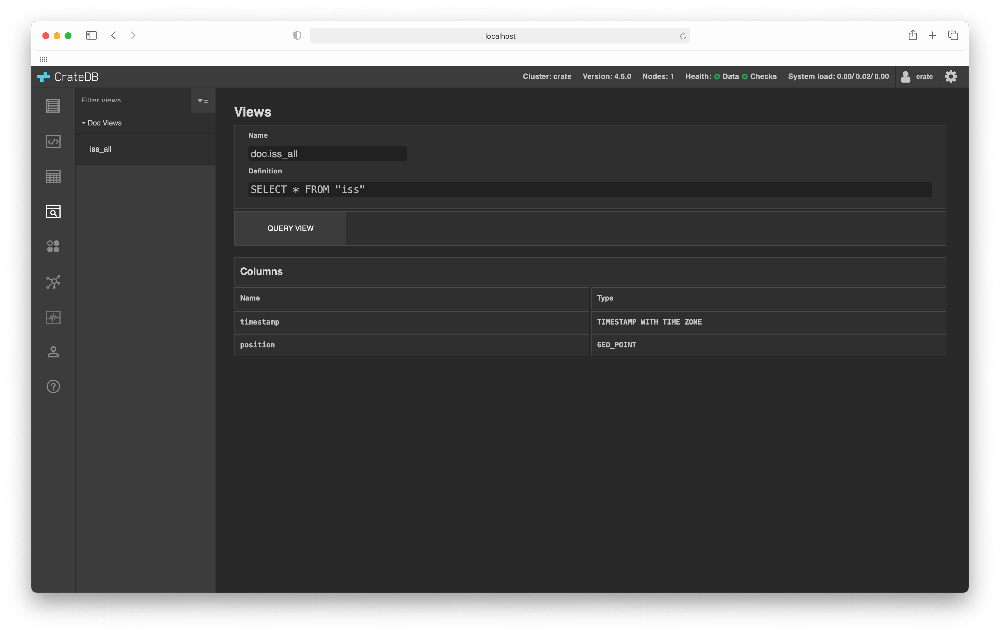

.. _views-browser:

=============
Views browser
=============

The :ref:`CrateDB Admin UI <index>` comes with a *views browser* that allows
you to inspect and query stored `views`_.

The top section on this screen shows you a basic :ref:`overview
<views-overview>`. If you select *QUERY VIEW* you can query the view using the
:ref:`SQL console <sql-console>`.

Below this, you will find the :ref:`columns information <views-columns>`.

.. _views-features:

Features
========

.. _views-overview:

View-level information
-----------------------

This section displays the following view-level information:

.. _views-name:

**Name**:
  The name of the view.

.. _views-definition:

**Definition**:
  The SQL query used to `create the view`_.

.. _views-columns:

Columns information
-------------------

This section section displays information about each view column:

.. _views-column-name:

**Name**:
  The name of the view column.

.. _views-column-type:

**Type**:
  The column `data type`_.

.. _views-other-features:

Other features
--------------

.. _views-display-toggle:

**Display toggle**:
  Different groups of views can be shown or hidden by toggling the
  corresponding arrow button on the left-hand sub-navigation menu.

.. _views-table-filter:

**View filter**:
  The displayed list of views can be filtered by entering text to match
  against the view name in the *Filter views* text input.

.. _create the view: https://crate.io/docs/crate/reference/en/latest/general/ddl/views.html
.. _data type: https://crate.io/docs/crate/reference/en/latest/general/ddl/data-types.html
.. _views: https://crate.io/docs/crate/reference/en/latest/general/ddl/views.html
